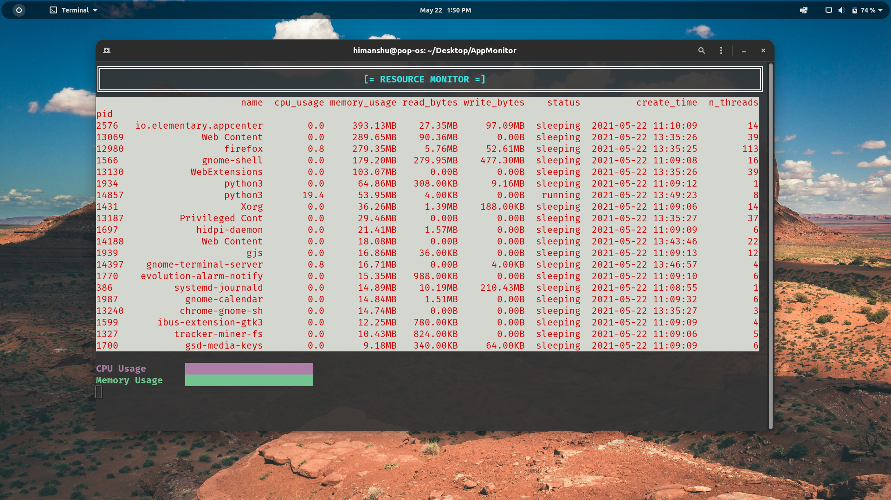

# **```TUI Resource Monitor```**

This is a **```Resource Monitor```** TUI app and all the arguments are listed explained later in the file. You are welcome to create a pull request for any sort of improvement/rectification.

## **Features :**
- Monitor your processes and hardware from the terminal
- Filter the columns to be shown
- Sort the stats by a column
- Kill any process instantly or set a timer to terminate
- Runs on Windows and Linux 

## **Upcoming Features :**
- Run live update and kill app together
- Terminal auto resize
- [Curses](https://docs.python.org/3/library/curses.html#module-curses) implementation

## Preview


### **Setup**
- Download all the files of this repository
- Install the necessary libraries as:
    - ```pip install psutil```
    - ```pip install pandas```
    - ```pip install win10toast```
    - ```pip install termcolor```
    - ```pip install notify2```
    - and ```Python3``` obviously
- OR execute [SetupLibraries.py](./SetupLibraries.py)

### **Usage**
- Run ```python ResourceMonitor.py -u``` in terminal
- Optional flags are: 

    - `Flag` | `Detail`
        ---|---
        **```-c column_name```**| *name of thhe column(s) to display*
        **```-s column_name```**| *name of the column to sort by [memory_usage by default]*
        **```--ascending```**| *add this if you want to sort in ascending order*
        **```-n number```**| *number of rows to display [25 by default]*
        **```-u```**| *wether to keep updating the display or not*
        **```--kill process --after time```**| *wether to kill a process after a certain minutes of usage. To kill a process immedietly, skip the 'after' flag*
        ---


**NOTE :** Please do not use the live update and the kill function together (This is so because depending upon the sytem specs, psutil takes some time to grab details. So running live update and kill together messes up the overall duration and hence process will be killed not as we want to.)
